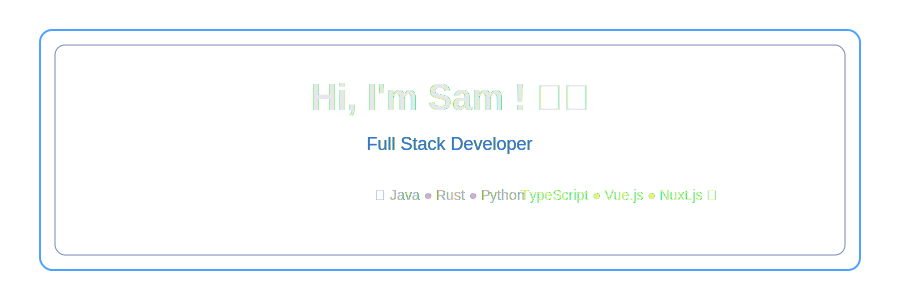

<h2 align="center">About Me</h2>

<h4 align="center">I'm Samuel Bonnet, a French third-year Computer Science student at <a href="https://www.iut-lens.univ-artois.fr/">IUT de Lens, France</a>

I enjoy building side projects to explore new ideas and learn new technologies.</h4>

<h2 align="center">Stack</h2>

<h3 align="center">Advanced</h3>

  

<h3 align="center">Familiar</h3>

  

<h4 align="center">
    <a href="https://rustacean.fr/">
    #Rustacean
    </a> fan
</h4>

<h2 align="center">System</h2>

  

<h2 align="center">Hardware</h2> 
<h4 align="center">
PC Building • Hardware Upgrades • Server Optimization
</h4>

<h2 align="center">Projects</h2>
<h4 align="center">
<a href="https://github.com/Samuel-BONNET/poker">Poker Online Multiplayer (Rust)</a> – Real-time WebSockets Poker Online

<a href="https://github.com/Samuel-BONNET/Crypto-Dashboard">Pokémon Dashboard (Nuxt)</a> – Management tool for collections & more !
</h4>

<h2 align="center">Philosophy</h2>
<h4 align="center">
"Why settle for ordinary when you can build something better?"*

"There is always a solution, otherwise it's not a problem anymore"*

</h4>

<h2 align="center">Contact</h2>

    
    &nbsp;&nbsp;&nbsp;&nbsp;
    

