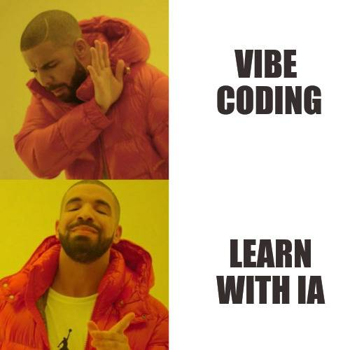

#  Hi, I'm Sam ! 🇫🇷

---

## Junior Full-Stack Developer
<strong style="color:#CFABE0;">◣ Java ● Rust ● Python</strong>
<strong> ─ </strong>
<strong style="color:#F2ED79;">Typescript ● Vue.js ● Nuxt.js ◥</strong>

I enjoy building side projects to explore new ideas and learn new technologies.

## About Me:

I'm Samuel Bonnet, a French third-year Computer Science student at [IUT de Lens, France](https://www.iut-lens.univ-artois.fr/)

### Stack :

| Advanced                                                                                            | Familiar                                                                                         |
|-----------------------------------------------------------------------------------------------------|--------------------------------------------------------------------------------------------------|
|         |         |
|  |  |

#### [#Rustacean](https://rustacean.fr/) fan

### System
- Linux (Arch, Debian)

### Hardware : 
- PC Building • Hardware Upgrades • Server Optimization

### Philosophy :
- *"Why settle for ordinary when you can build something better?"*
- *"There is always a solution, otherwise it's not a problem anymore"*

---

## Projects

- ### [Poker Online Multiplayer (Rust)](https://github.com/Samuel-BONNET/poker) – Real-time game with WebSockets
- ### [Pokémon Dashboard (Nuxt)](https://github.com/Samuel-BONNET/Crypto-Dashboard) – Management tool for collections & more !

---

## Contact

- 🟦 [LinkedIn](https://www.linkedin.com/in/samuel-bonnet1)
- 📧 [Email](s.bonnet230906@gmail.com)  
